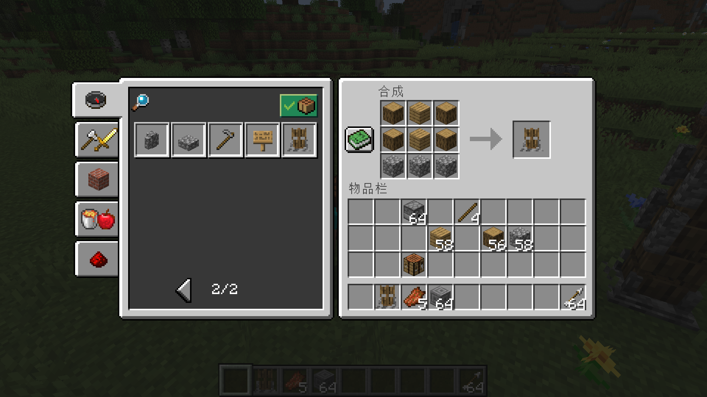
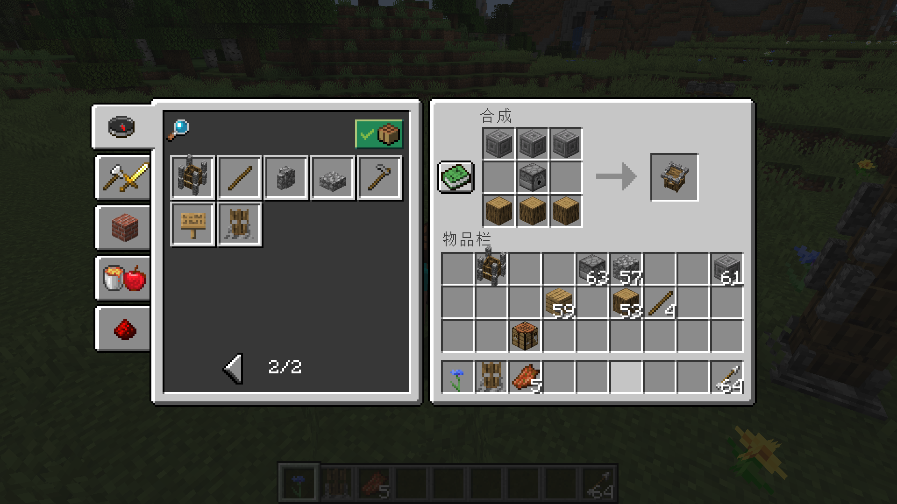
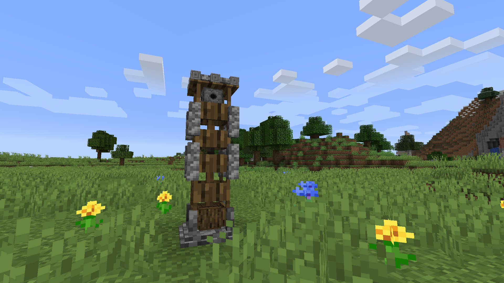
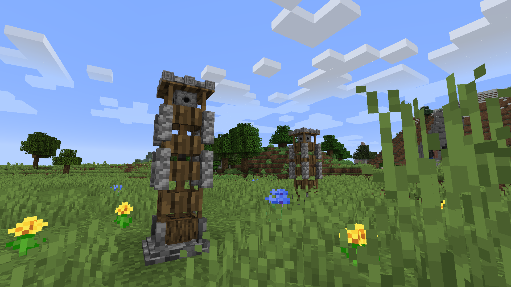
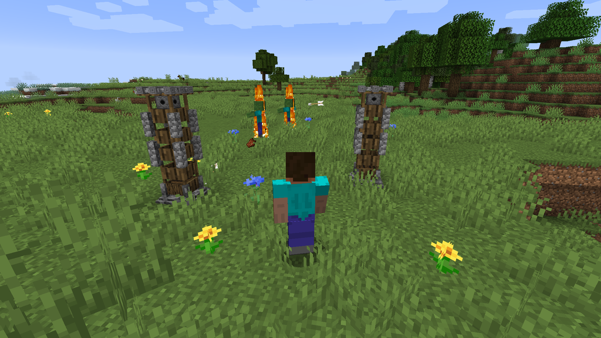

# Sentry Mod

古老、传统又实用的箭塔。居家旅行必备，是你身边最强大可靠的守护。

添加了三种箭塔方块。分别是炮基、炮身、炮台。

## 使用指南

其中炮基负责装箭，炮塔负责🐍。放置顺序从下到上必须是炮基、炮身、炮台。

你需要右键点击炮基来将箭矢放入其中，如果炮身、炮台放置顺序正确，炮台将会以固定频率射击箭矢。目前只支持箭矢射击。

### 炮基

### 炮身

### 炮塔

## 截图

